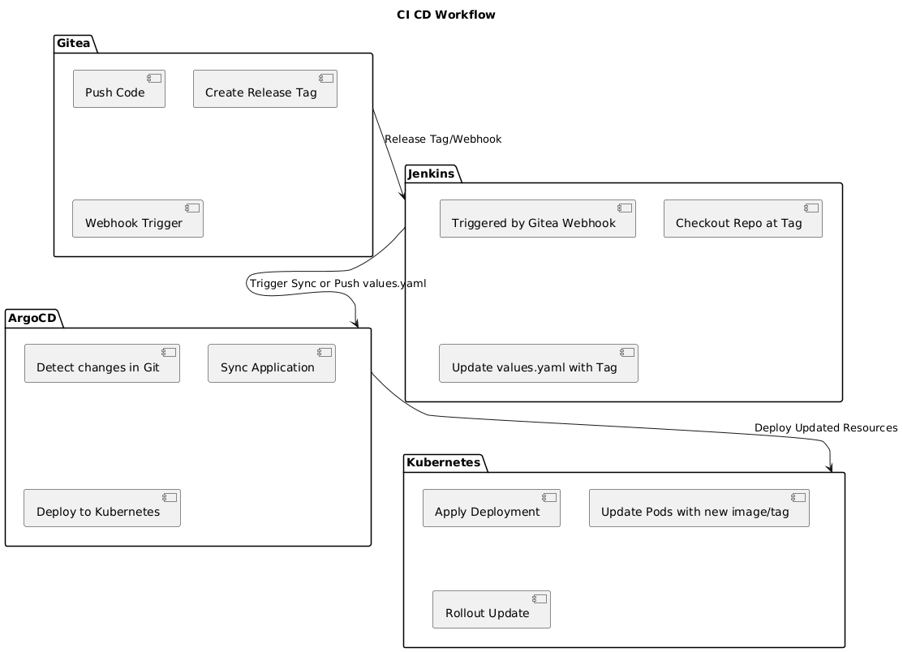
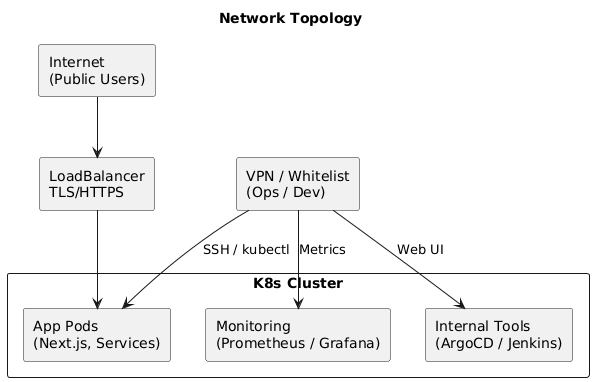

## System Architecture

### Core Infrastructure Components

| Component | Technology | Purpose |
|-----------|-----------|---------|
| Source Control | Gitea | low resource usage and avoids vendor lock-in |
| Build Pipeline | Jenkins | free with extensive plugin ecosystem and minimal overhead |
| Orchestration | Kubernetes + ArgoCD | enables automated rollbacks and version-controlled deployments |
| Container Registry | Docker Registry v2 | simple setup with efficient caching for faster deployments |
| Infrastructure as Code | OpenTofu | terraform-compatible without licensing restrictions |

Database migrations run via kubernetes `initContainers` for stateful apps, and add monitoring for success or failed migrations

## CICD Workflow Diagram

### Production Release Workflow

Jenkins triggers only on Git tags (example, `v1.2.3`), not every commit

1. Git tag creation trigger Jenkins webhook
2. Multi-stage docker build
3. Push versioned image to registry
4. Jenkins updates `values.yaml` in gitops repo
5. ArgoCD sync changes automatically
6. Kubernetes rolling deployment with health check

## Network Architecture

### Traffic Segmentation

- Public => external clients → kubernetes ingress with SSL termination
- Internal => VPN → internal service

## Technical Principles

- Distributed Resilience => no single point of failure
- Cloud Portability => vendor-agnostic with openTofu + kubernetes
- Immutable Infrastructure => container-based with versioned artifact

## Monitoring and Alerting (Not in challenge, but production recommendation)

- Metrics => Node Exporter (system), Prometheus (apps), Kubernetes (cluster)
- Alerts => Critical (>90% disk, 5min response), Warning (>70% disk, 30min response)
- Channels => Slack, Discord, OpsGenie

## Backup and Recovery

- Infrastructure => OpenTofu state in GCS (5-10 versions), But I personally recommended using altantis for single machine deployment and natively support GCS or Bucket for saving state
- Containers => Registry keeps last 3-5 releases
- Source Code => Bare repos + DB dumps (6-12 months)
- App Data => Take snapshot every day, save at least 1 week snapshot
- Databases => Take full backup every day, dan keep at least 2 week - 4 week the retention, also keep test & compare the backup with live data at least once of a month
